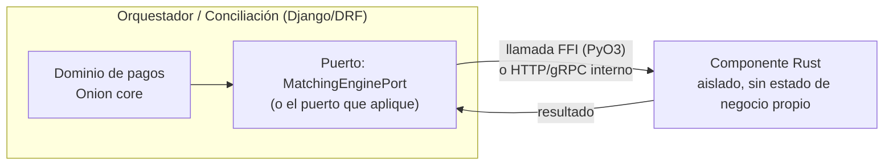

# Decisión: arquitectura híbrida Python/Django + Rust

> Basado en `research-rust-vs-django.md`. Decisión del usuario (2026-08-27):
> adoptar el patrón híbrido, no reescribir el sistema en Rust.

## Principio

**El 95% del sistema vive en Django/DRF** (todo lo que ya está en marcha:
Orquestador, Conciliación, panel admin, integraciones con BDV). **Rust se
reserva exclusivamente para componentes aislados, específicos, con cuello de
botella de cómputo real** — no para reescribir servicios enteros.

Esto no es indecisión ni "usar lo de moda": es la arquitectura Onion +
Screaming ya definida en el roadmap llevada a su consecuencia lógica — el
dominio no depende de Django ni de RabbitMQ, tampoco depende de qué lenguaje
implementa un adaptador de infraestructura puntual. Un componente en Rust es,
para el dominio, solo otro adaptador detrás de un puerto.

## Cómo se integra en la práctica

Dos formas de integrar el componente Rust, según el caso:

1. **Extensión nativa vía FFI (PyO3 + `maturin`)** — el componente Rust se
   compila como un módulo Python importable (`import matching_engine_rs`).
   Mejor cuando la latencia de red entre procesos no es aceptable y el
   componente corre *dentro* del mismo proceso Django/Celery worker.
2. **Microservicio aparte (HTTP/gRPC interno)** — el componente Rust corre
   como su propio servicio, consumido por Django vía un cliente HTTP simple.
   Mejor cuando el componente tiene su propio ciclo de despliegue, necesita
   escalar independientemente, o el equipo prefiere no acoplar el build de
   Django al toolchain de Rust (`cargo`).

En ambos casos, el dominio Django define el puerto (interfaz) y no sabe ni le
importa si la implementación detrás es Python o Rust — coherente con Onion.

## Componentes confirmados para extraer a Rust (decisión del usuario, 2026-08-27)

No son solo candidatos a evaluar — son los **dos puntos de extracción ya
decididos** para cuando se cumpla su condición de disparo. El camino
síncrono crítico (autorizar/capturar) no entra en esta lista: sigue siendo
I/O-bound y se queda en Django sin excepción.

| Candidato | Dónde vive hoy (Django) | Cuándo se justificaría extraerlo a Rust |
|---|---|---|
| Motor de matching de Conciliación | `ConsultaConciliacionProveedor` + `Discrepancia` (comparación registro a registro) | Si el volumen de movimientos a conciliar por lote crece a un punto donde el matching en Python se vuelve medible como cuello de botella real (miles/millones de registros por corrida) |
| Validación/cálculo del ledger de doble entrada | `TransaccionLedger` + `LineaLedger` | Si el volumen de asientos por reproceso de 6 meses de historial (caso ya previsto en el roadmap) empieza a tardar de forma notoria |

**Regla de decisión para extraer un componente:** solo cuando haya un dato
real de que ese componente específico es CPU-bound y mide un impacto
concreto en SLO — nunca de forma anticipada ni especulativa. Hasta entonces,
ambos se implementan en Django como cualquier otro módulo del dominio.

> Nota: el cálculo de tasa cambiaria en lote (`TasaCambioAplicada`) no entra
> en esta lista — está fuera de alcance junto con tarjeta/tokenización,
> porque el proyecto no hace conversión de divisas (ver `db-plan-pagos.md`).
> Si ese alcance cambiara en el futuro, se evaluaría por separado.

## Qué implica para el trabajo de `suit-backend` ahora mismo

- **Nada cambia en el bloque de próximo paso #1** (modelos del Orquestador) —
  sigue siendo 100% Django, no hay componente Rust en esta fase.
- Sí implica una regla de diseño a respetar desde ya: **el motor de matching
  de Conciliación y el validador de balance del ledger deben quedar detrás de
  un puerto/interfaz explícito** (ej. `MatchingEnginePort`,
  `LedgerBalancePort`) en la capa de dominio, aunque su primera implementación
  sea Python puro — así, si más adelante se decide extraer a Rust, el cambio
  queda contenido en la capa de infraestructura, sin tocar el dominio ni los
  demás módulos.
