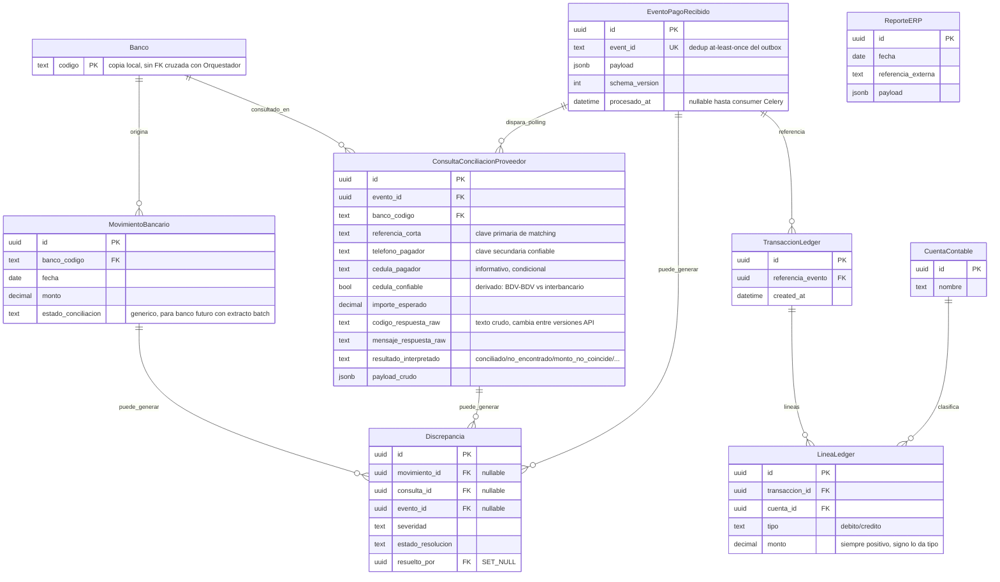
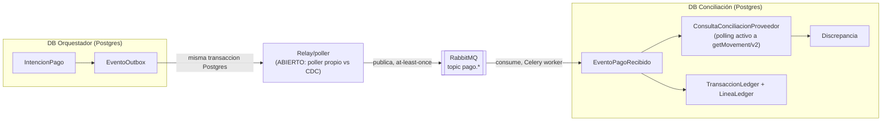

# Modelo de datos — Suite Centralizada de Pagos (v1, primera pasada)

> Generado por el coordinador a partir de `suit-backend/db-plan-pagos.md`
> (autor: agente `expert_database`, worktree `db-backend`). Es un bosquejo de
> planificación, no un esquema final — quedan puntos abiertos marcados en el
> plan original (sección 5). Dos bases PostgreSQL independientes, **sin FKs
> cruzadas entre ellas** (`database-per-service`): toda relación entre
> Orquestador y Conciliación es un ID lógico que viaja en el evento RabbitMQ
> `pago.*`, nunca un JOIN.

## Diagrama — DB Orquestador (síncrono)

```mermaid
erDiagram
    MedioPago ||--o{ IntencionPago : "tipifica"
    ProveedorPago ||--o{ Autorizacion : "ejecuta"
    ProveedorPago ||--o{ Captura : "ejecuta"
    ProveedorPago ||--o{ Anulacion : "ejecuta"
    ProveedorPago ||--o{ Reembolso : "ejecuta"
    ProveedorPago ||--o{ TipoOperacionProveedor : "define"
    ProveedorPago ||--o{ CodigoRespuestaProveedor : "define"
    ProveedorTokenizacion ||--o{ TokenReferencia : "emite"
    Banco ||--o{ ProveedorPago : "opera_como"

    IntencionPago ||--o{ TransicionEstadoPago : "historial"
    IntencionPago ||--o{ Autorizacion : "autorizaciones"
    IntencionPago ||--o{ Captura : "capturas"
    IntencionPago ||--o{ Anulacion : "anulaciones"
    IntencionPago ||--o{ Reembolso : "reembolsos"
    IntencionPago ||--o| TokenReferencia : "opcional_si_tarjeta"
    IntencionPago ||--o| TasaCambioAplicada : "si_internacional"
    IntencionPago ||--o| IdempotencyKey : "protegido_por"
    IntencionPago ||--o{ EventoOutbox : "publica"

    TipoOperacionProveedor ||--o{ Autorizacion : "clasifica"
    CodigoRespuestaProveedor ||--o{ Autorizacion : "clasifica"

    IntencionPago {
        uuid id PK
        decimal monto
        text moneda "TextChoices: VES activo, USD reservado"
        uuid app_origen_id "FK logica, sin FK real (Developer Portal)"
        text estado_actual "espejo de TransicionEstadoPago"
        text routing_flag "legacy/canario, strangler fig"
    }
    TransicionEstadoPago {
        uuid id PK
        uuid pago_id FK
        text estado_anterior
        text estado_nuevo
        datetime created_at "append-only, sin updated_at"
    }
    Autorizacion {
        uuid id PK
        uuid pago_id FK
        uuid proveedor_id FK
        text referencia_corta "correlacion con Conciliacion"
        text identificador_interbancario "endToEndId, usado para anular"
        uuid tipo_operacion_id FK
        uuid codigo_respuesta_id FK
        jsonb payload_crudo
        datetime otp_solicitado_at
    }
    Captura {
        uuid id PK
        uuid pago_id FK
        uuid proveedor_id FK
        text referencia_corta
        text identificador_interbancario
    }
    Anulacion {
        uuid id PK
        uuid pago_id FK
        uuid proveedor_id FK
    }
    Reembolso {
        uuid id PK
        uuid pago_id FK
        uuid proveedor_id FK
    }
    TokenReferencia {
        uuid id PK
        uuid pago_id FK
        uuid proveedor_tokenizacion_id FK
        text token "opaco, nunca PAN/CVV"
    }
    EventoOutbox {
        uuid id PK
        uuid pago_id FK
        text event_type "pago.*"
        jsonb payload
        int schema_version
        text estado "pendiente/enviado/fallido"
        datetime sent_at
    }
    IdempotencyKey {
        uuid key PK "generado por el cliente"
        text request_hash
        jsonb response_snapshot
        datetime expires_at "ABIERTO: valor sin definir"
    }
    TasaCambioAplicada {
        uuid id PK
        uuid pago_id FK
        decimal tasa
        text fuente
        datetime rate_timestamp "congelada por transaccion"
    }
    MedioPago { uuid id PK text nombre }
    ProveedorPago { uuid id PK text nombre "primer proveedor real: BDV" }
    ProveedorTokenizacion { uuid id PK text nombre "ABIERTO: sin proveedor real aun" }
    Banco { text codigo PK "4 digitos SUDEBAN/BCV" text nombre }
    TipoOperacionProveedor { uuid id PK uuid proveedor_id FK text codigo }
    CodigoRespuestaProveedor { uuid id PK uuid proveedor_id FK text codigo text categoria }
```

## Diagrama — DB Conciliación (asíncrono, solo consume eventos)

## Flujo entre servicios (sin FK, solo eventos)

## Puntos abiertos que afectan directamente este modelo

Ver detalle completo y razonamiento en `suit-backend/db-plan-pagos.md` §5.
Resumen de estado:

| # | Punto | Estado |
|---|---|---|
| 1 | Proveedor real de tokenización de tarjeta | `ABIERTO` |
| 2 | Mecanismo del relay outbox → RabbitMQ (poller vs CDC) | `ABIERTO` |
| 3 | Catálogo definitivo de monedas | `PARCIAL` — VES activo, USD reservado |
| 4 | Dónde vive `AppConsumidora`/API keys | `ABIERTO` |
| 5 | Mecanismo de balance-cero del ledger (trigger vs. servicio) | `ABIERTO` |
| 6 | Ventana de expiración de `IdempotencyKey.expires_at` | `ABIERTO` |
| 7 | Gobernanza del schema de eventos versionado | `ABIERTO` |
| 8 | Semántica de reintentos multi-adquirente | `PARCIAL` — despriorizado hasta T4 |

## Fuentes

- `conatel-suite-pagos-roadmap.html` (roadmap del proyecto)
- `research-brief-pagos.md` (mejores prácticas + hallazgos de 2 PDFs reales de BDV: API C2P Cuentas Múltiples, API Conciliación)
- `suit-backend/db-plan-pagos.md` (plan de modelado de `expert_database`)
