# Documentación Completa — Suite Centralizada de Pagos (Conatel)

> Documento generado leyendo el código real del monorepo (no solo los documentos
> de planificación). Pensado para alguien que nunca vio este proyecto pero que
> sabe programar: qué es esto, cómo está armado, cómo fluye un cobro de punta a
> punta, qué hay en cada subproyecto, qué funciona hoy de verdad y qué falta.
>
> Última verificación de código: 2026-08-29. Para el historial detallado de
> cada bloque de trabajo ver `PLAN-DE-MEJORAS.md`; para el estado operativo de
> la sesión de desarrollo ver `ORCHESTRATION-STATUS.md`; para el contrato de
> API verificado endpoint por endpoint ver `CONTRATO-API-ACTUAL.md`.

---

## 1. Qué es esto y para qué sirve

### 1.1 El problema que resuelve

Conatel (organismo del estado venezolano) tiene varias aplicaciones que en
algún momento necesitan cobrarle algo a alguien (una tasa, un trámite, una
multa). Cada una de esas apps (hoy "Conatel en Línea", "Homologación", y
futuras) podría integrar el cobro por su cuenta contra el banco — pero eso
significa que cada equipo reinventa la integración bancaria, maneja sus propias
credenciales del proveedor de pago, y nadie tiene una vista centralizada de
"cuánto se cobró, a quién, y si ese dinero realmente llegó al banco".

La Suite Centralizada de Pagos es exactamente eso: un **payment gateway
interno**. Las apps de Conatel no hablan directo con el banco — le piden a
esta Suite que cobre por ellas, y la Suite se encarga de la integración
bancaria, de dejar registro de todo, y de avisar cuando el cobro terminó.

### 1.2 Conceptos de negocio (bancarios/pagos)

Estos son los términos de dominio de pagos, explicados en el contexto
específico de cómo se usan acá — no la definición genérica de wikipedia.

- **C2P (Customer-to-Payer / "cliente a comercio")**: modalidad de cobro donde
  el pagador (una persona) le paga a un comercio (Conatel) usando su teléfono
  y su banco, sin pasar tarjeta física ni número de tarjeta. En Venezuela el
  mecanismo popular para esto es **Pago Móvil**: el pagador da su cédula,
  teléfono y banco, recibe un código OTP (One-Time Password, un código de un
  solo uso) por SMS, lo confirma, y el banco mueve la plata. Este proyecto
  integra el **C2P de BDV (Banco de Venezuela)** — el primer y único proveedor
  real hoy, aunque el diseño no asume que sea el único para siempre (por eso
  hay un catálogo de bancos y de proveedores, no un hardcode a "BDV").
- **OTP**: el código de un solo uso que el banco manda por SMS al teléfono del
  pagador para confirmar que es realmente él quien autoriza el cobro. En este
  proyecto es el segundo factor de autenticación del cobro — sin OTP correcto,
  BDV rechaza la operación.
- **Conciliación bancaria**: después de que un cobro "sucede" del lado del
  Orquestador (BDV respondió éxito), alguien tiene que verificar contra el
  extracto real del banco que esa plata efectivamente entró y que el monto
  coincide. Eso es "conciliar": cruzar lo que el sistema cree que pasó contra
  lo que el banco dice que pasó. Si no coinciden, se genera una
  **discrepancia** que un humano (staff) tiene que revisar y resolver. En este
  proyecto la conciliación es asíncrona — nunca bloquea ni retrasa el cobro en
  sí, ocurre después, por su cuenta.
- **Ledger de doble entrada**: la forma clásica de contabilidad donde cada
  movimiento de dinero se registra dos veces — un débito y un crédito que
  siempre deben sumar cero entre sí (nunca "aparece" ni "desaparece" plata sin
  que quede un asiento contable que lo explique). `suit-conciliacion` lo
  implementa con dos tablas (`TransaccionLedger` agrupa, `LineaLedger` son las
  líneas individuales) y — decisión clave del proyecto — el balance-cero **no
  se valida en el código Python**, se fuerza con un trigger dentro de la propia
  base de datos Postgres, para que sea estructuralmente imposible grabar un
  asiento descuadrado, sin importar qué bug tenga el código de arriba.

### 1.3 Conceptos técnicos (explicados como se usan acá)

- **API REST / DRF (Django REST Framework)**: los 2 backends (`suit-orquestador`,
  `suit-conciliacion`) son proyectos Django que exponen su funcionalidad como
  endpoints HTTP JSON usando DRF, la librería estándar para construir APIs REST
  sobre Django (serializers para validar/transformar datos, views para la
  lógica de request/response, permisos para controlar quién puede llamar qué).
- **Next.js / App Router**: los 2 frontends (`suit-panel`, `suit-portal`)
  son proyectos React usando Next.js con su "App Router" (el sistema de rutas
  moderno de Next.js, basado en carpetas dentro de `app/`, con Server
  Components y Server Actions — código que corre en el servidor Next.js, no en
  el navegador, y que puede llamar a los backends Django guardando secretos
  como tokens sin exponerlos nunca al cliente).
- **`checkout_token`**: no es un concepto genérico de la industria, es el
  mecanismo específico que inventó este proyecto para resolver un problema de
  seguridad real (ver sección 3 y 4.1): un token opaco y firmado
  criptográficamente (con `django.core.signing`, no JWT) que el Orquestador le
  entrega a la app consumidora cuando esta pide iniciar un cobro. Ese token
  encapsula **qué aplicación es**, **qué proveedor va a usar**, y —
  crucialmente — **el monto exacto a cobrar**, todo atado con firma. Vence a
  los 15 minutos. La razón de que el monto viaje adentro del token firmado y no
  en un parámetro suelto de la URL es el punto de seguridad más importante de
  todo el proyecto: si el monto viajara en la URL del iframe, cualquier
  pagador con conocimientos técnicos podría editarlo y auto-reducirse su
  propia factura, porque el OTP solo prueba "quién es el pagador", nunca
  "cuánto debería estar pagando".
- **Idempotencia / `idempotency_key`**: en un sistema de pagos, un mismo
  request de cobro no puede ejecutarse dos veces por accidente (por ejemplo,
  si el navegador reintenta un POST porque no vio la respuesta a tiempo) — eso
  cobraría dos veces a la misma persona. La solución es que el cliente mande
  una clave única (`idempotency_key`) junto al request; el servidor la guarda,
  y si ve la misma clave otra vez, en vez de repetir el cobro, devuelve la
  respuesta que ya había dado la primera vez (o rechaza si el contenido del
  request cambió, lo cual indicaría un bug del cliente, no un reintento
  legítimo).
- **Outbox pattern**: el problema que resuelve es este: cuando el Orquestador
  termina de cobrar, tiene que (a) guardar el resultado en su propia base de
  datos Y (b) avisarle a Conciliación que pasó algo, publicando un mensaje en
  RabbitMQ. Si hiciera esas dos cosas como pasos separados, podría pasar que
  guarde el resultado pero se caiga justo antes de publicar el mensaje — y el
  evento se pierde para siempre, aunque el cobro sí ocurrió. El patrón outbox
  evita esto: en vez de publicar directo a RabbitMQ, el Orquestador escribe una
  fila en una tabla `EventoOutbox` **dentro de la misma transacción de base de
  datos** que graba el resultado del cobro — o se guardan las dos cosas juntas,
  o ninguna. Después, un proceso separado (el "relay", un poller de Celery que
  corre cada 5 segundos) lee esa tabla y publica lo pendiente a RabbitMQ,
  marcando cada fila como "enviada" solo después de que el broker confirmó
  que la recibió.
- **Evento vs webhook**: un webhook es cuando un servidor le hace un POST HTTP
  directo a otro servidor para avisarle algo (acoplamiento directo, si el que
  recibe está caído el mensaje se pierde salvo que quien envía reintente). Un
  evento en este proyecto es distinto: el Orquestador nunca le habla
  directamente a Conciliación — publica un mensaje a RabbitMQ (`pago.confirmado`,
  con un `schema_version` para poder evolucionar el contrato sin romper a
  quien ya lo consume) y Conciliación lo consume cuando puede, sin que el
  Orquestador sepa ni le importe si Conciliación está arriba, caída, o
  reprocesando algo. Es "publicar y olvidarse" con garantías de entrega, no una
  llamada directa.
- **Celery / RabbitMQ**: Celery es la librería Python para correr tareas en
  segundo plano (fuera del ciclo request/response de Django); RabbitMQ es el
  "broker" — la pieza de infraestructura que efectivamente guarda y entrega
  esos mensajes. En este proyecto RabbitMQ cumple dos roles: (1) es el bus de
  eventos de negocio `pago.*` entre Orquestador y Conciliación (un consumer
  propio hecho a mano, no una tarea Celery estándar, para no depender del
  protocolo de tareas), y (2) es también el broker que usa Celery internamente
  para sus propias tareas (el poller del outbox en el Orquestador, la tarea de
  ingesta en Conciliación).
- **CSP / `frame-ancestors`**: el formulario de cobro del Orquestador se
  embebe dentro de un `<iframe>` en la página de la app consumidora (Conatel en
  Línea, por ejemplo). Cualquier página en internet podría intentar embeber
  ese mismo formulario dentro de un iframe suyo para hacer phishing (mostrar el
  formulario real de Conatel pero capturando los datos con JavaScript propio).
  El header HTTP `Content-Security-Policy: frame-ancestors <dominios>` es la
  forma moderna de decirle al navegador "este contenido solo puede embeberse
  dentro de estos dominios exactos, ningún otro" — y en este proyecto se
  calcula dinámicamente por request, contra la lista real de dominios
  registrados para esa aplicación específica, nunca un valor estático ni un
  wildcard.
- **JWT**: un token firmado que codifica quién sos y hasta cuándo sos válido,
  sin que el servidor tenga que consultar una base de datos para verificarlo
  (solo verifica la firma). `suit-conciliacion` lo usa para autenticar al
  staff que entra al panel administrativo (`simplejwt`: access token de vida
  corta + refresh token de vida más larga guardado en una cookie
  `HttpOnly`). `suit-orquestador` **no usa JWT de usuario final** — sus
  endpoints públicos de cobro son `AllowAny` (pensados para que los llame el
  servidor de la app consumidora o el navegador del pagador dentro del
  iframe, no un usuario logueado), y solo usa `TokenAuthentication` simple
  para los endpoints de administración (dar de alta apps/dominios).
- **CORS / CSRF**: CORS controla qué orígenes (dominios) pueden hacerle
  requests desde el navegador a una API; CSRF protege contra que una página
  maliciosa haga que el navegador de un usuario logueado ejecute una acción sin
  que se dé cuenta. `suit-conciliacion` sí configura CORS explícitamente
  (`django-cors-headers`, porque su panel `suit-panel` es un cliente
  separado en otro origen que necesita llamarlo desde el navegador).
  `suit-orquestador` **no tiene CORS configurado** — decisión consciente,
  porque sus endpoints públicos no dependen de cookies de sesión de navegador
  (son `AllowAny`, sin estado de sesión que CORS necesite proteger).

---

## 2. Arquitectura general

### 2.1 Los 4 subproyectos (+ deploy)

```
suit_pagos/                    ← monorepo, un solo repo git
├── suit-orquestador/          ← Django/DRF — cobro C2P (síncrono)
├── suit-conciliacion/         ← Django/DRF — conciliación bancaria (asíncrono)
├── suit-panel/             ← Next.js — panel administrativo interno (staff)
├── suit-portal/               ← Next.js — Developer Portal (para equipos externos)
└── deploy/                    ← Dockerfiles + docker-compose.yml (orquesta los 4 + infra)
```

Cada subproyecto es **independiente en runtime**: su propia base de datos (o
ninguna, en el caso de los frontends), su propio deploy, su propio ciclo de
vida. Comparten únicamente el repositorio git — es una decisión explícita del
proyecto, no un descuido: nada impide que en el futuro cada uno viva en su
propio repo si hiciera falta.

### 2.2 Por qué separados así

- **Orquestador vs Conciliación, como servicios de datos distintos**: el
  Orquestador es el camino **síncrono y crítico** — el pagador está esperando
  la respuesta del OTP y del cobro en tiempo real, no puede tardar. La
  Conciliación es **asíncrona** — corre después, en segundo plano, cruzando
  contra el banco cuando puede. Separarlos en dos servicios (con dos bases de
  datos completamente distintas, ver 2.3) garantiza que un problema de
  Conciliación (un query lento, un banco QA que no responde, un reproceso
  masivo de historial) **nunca pueda degradar la latencia de un cobro real en
  curso**. Si compartieran proceso o base de datos, esa garantía no sería
  real, sería solo una convención de equipo.
- **Frontend vs Portal**: `suit-panel` es para el staff interno de Conatel
  (login con usuario/contraseña, ve discrepancias y eventos). `suit-portal` es
  para los equipos de las apps consumidoras — no requiere login propio hoy
  (ver gaps, sección 5), sirve para registrar su aplicación/dominio y probar la
  integración del iframe. Son audiencias y ciclos de vida distintos, con
  distinto nivel de exposición pública.

### 2.3 Por qué dos bases de datos separadas y no una con schemas

Decisión evaluada explícitamente (`investigaciones/research-schemas-vs-bases-separadas.md`)
y no trivial: **dos instancias Postgres completamente separadas
(`postgres-orquestador`, `postgres-conciliacion`), nunca un solo Postgres con
dos schemas**. Los motivos, en orden de peso:

1. **Aislamiento de fallos real**: dos procesos Postgres distintos no
   comparten memoria compartida, WAL, ni catálogo — un pico de carga o un
   query pesado en Conciliación no puede consumir recursos que le hagan falta
   al Orquestador. Con schemas, comparten el mismo proceso físico — el
   aislamiento sería solo lógico, no de fallos.
2. **Imposibilidad estructural de acoplarse por accidente**: entre bases de
   datos distintas, Postgres no permite un JOIN ni una FK cruzada sin
   `dblink`/`postgres_fdw` (que nadie instaló). Con schemas, un JOIN cruzado es
   trivial de escribir y ninguna herramienta lo impide — dependería
   únicamente de que ningún desarrollador, bajo presión, tome ese atajo. La
   única frontera real entre ambos servicios debe ser el bus de eventos
   RabbitMQ, nunca una consulta directa a los datos del otro.
3. Políticas de HA/backup/connection-pooling diferenciadas por criticidad, y
   una historia de segmentación más limpia de cara a una eventual auditoría
   PCI-DSS.

En el código real esto se ve reflejado sin ambigüedad: no hay ninguna FK entre
modelos de `suit-orquestador` y `suit-conciliacion` — la única relación entre
ambos es un ID lógico (`event_id`, `pago_id`) que viaja dentro del payload del
evento RabbitMQ.

### 2.4 Por qué RabbitMQ y no Redis

También evaluado explícitamente
(`investigaciones/research-rabbitmq-vs-redis.md`). El resumen: para el bus de
eventos de negocio `pago.*`, perder un mensaje es inaceptable (significaría que
un cobro real ocurrió pero Conciliación nunca se enteró — el riesgo de
"doble contabilidad" o de que un cobro nunca se concilie). RabbitMQ da
garantías de durabilidad **por defecto** (con publisher confirms, el ACK que
recibe quien publica significa que el mensaje ya fue escrito a disco); Redis
(incluso su variante más robusta, Streams) requiere configuración explícita y
cuidadosa para acercarse a esa garantía, y no es su comportamiento por
defecto. Además RabbitMQ tiene dead-letter queues nativas (reenrutamiento
automático de mensajes fallidos), mientras que en Redis Streams ese patrón
hay que construirlo a mano.

Redis **no está descartado del proyecto en general** — queda como la elección
correcta para roles complementarios (cache, locks distribuidos, rate limiting)
si en algún momento hiciera falta, pero hoy **no aparece en ningún
`docker-compose.yml` ni en el código real** — no se agregó sin una necesidad
concreta y medible (criterio YAGNI aplicado de forma consistente en todo el
proyecto).

### 2.5 Diagrama de comunicación entre servicios

```mermaid
flowchart LR
    subgraph AppConsumidora["App consumidora (Conatel en Línea, etc.)"]
        Srv["Servidor de la app"]
        Nav["Navegador del pagador"]
    end

    subgraph Orq["suit-orquestador (Django, síncrono)"]
        API["API de autorización/cobro"]
        DBO[("Postgres\norquestador_pagos")]
        Poller["Poller Celery beat\n(relay outbox)"]
    end

    subgraph MQ["RabbitMQ"]
        Ex[["exchange 'pago' (topic)"]]
    end

    subgraph Conc["suit-conciliacion (Django, asíncrono)"]
        Worker["Worker Celery\n(bootstep consumer)"]
        DBC[("Postgres\nconciliacion_pagos")]
    end

    subgraph Panel["suit-panel (Next.js)"]
        UI1["Panel staff"]
    end

    subgraph Portal["suit-portal (Next.js)"]
        UI2["Developer Portal"]
    end

    BDV[["BDV Pago Móvil C2P\n+ getMovement/v2"]]

    Srv -- "1. validar-acceso (server-to-server)" --> API
    API -- "checkout_token" --> Srv
    Srv -- "renderiza iframe" --> Nav
    Nav -- "2. formulario cobro (OTP, cobro)" --> API
    API <-- "3 pasos: OTP/cobro/anulación" --> BDV
    API -- "escribe en misma transacción" --> DBO
    DBO -. EventoOutbox pendiente .-> Poller
    Poller -- "publica, publisher confirms" --> Ex
    Ex -- "consume, routing key pago.#" --> Worker
    Worker --> DBC
    Worker <-- "getMovement/v2" --> BDV
    UI1 -- "lee discrepancias/eventos/ledger" --> Conc
    UI2 -- "registra apps/dominios (admin)" --> API
    UI2 -- "prueba iframe real" --> API
```



Puntos clave del diagrama: el Orquestador **nunca llama directamente** a
Conciliación (ni al revés) — la única conexión es a través de RabbitMQ. El
panel (`suit-panel`) **solo lee de Conciliación**, nunca del Orquestador
(decisión de alcance: hoy no hay ninguna vista del panel que necesite datos
crudos de pagos en curso). El Developer Portal (`suit-portal`) sí habla con el
Orquestador (para registrar apps y para la página de prueba del iframe).

---

## 3. El flujo real de un cobro, de punta a punta

Contado como una historia, con los nombres reales de servicios/campos del
código.

**0. Antes de cobrar nada, la app tiene que estar registrada.** Un
desarrollador entra al Developer Portal (`suit-portal`), va a "Registrar
aplicación" y completa nombre, dominio exacto (sin protocolo ni puerto,
ej. `conatel.gob.ve`) y proveedor de pago (`BDV`, único disponible hoy). Ese
formulario hace un POST real (no mockeado) a
`suit-orquestador`, autenticado con un token de administrador que vive
server-side en `suit-portal/.env` (`ORQUESTADOR_ADMIN_TOKEN`, nunca llega al
navegador). Esto crea una fila real en `AplicacionRegistrada` +
`DominioPermitido` + `AplicacionProveedorPermitido`. Sin este registro, el
paso 1 de abajo devuelve `403`.

**1. La app consumidora (su servidor, nunca el navegador) inicia el
checkout.** Hace `POST /api/autorizacion/validar-acceso/` contra el
Orquestador con `{dominio, proveedor, monto, moneda, concepto}`. El
Orquestador valida la cadena dominio→app→proveedor
(`ValidacionAccesoService`), y si todo está en orden, **firma** esos datos
(incluido el monto) dentro de un `checkout_token` opaco (Django signing, vence
en 15 minutos) y se lo devuelve: `{"autorizado": true, "checkout_token": "..."}`.
Esto tiene que hacerse desde el servidor de la app, nunca desde el navegador,
porque es el único momento en que el monto queda atado criptográficamente —
después de este paso, nadie puede alterarlo.

**2. La app consumidora embebe el iframe.** Renderiza en su página
`<iframe src=".../api/autorizacion/cobro/formulario/?checkout_token=...">`.
Cuando el navegador del pagador pide esa URL, el Orquestador
(`FormularioCobroView`) valida el `Origin`/`Referer` de esa petición GET
contra los `DominioPermitido` activos de la app, y si coincide, responde el
HTML del formulario con un header `Content-Security-Policy: frame-ancestors
<dominio>:*` calculado dinámicamente — solo ese dominio exacto puede embeberlo.
Si no coincide, `403` sin CSP permisivo (el navegador ya lo hubiera bloqueado
igual, pero el backend no confía únicamente en eso).

**3. El pagador completa el formulario.** Le pide banco (selector poblado del
catálogo real, hoy solo `0102` BDV), cédula, teléfono. El JavaScript del
formulario llama primero a `POST /api/autorizacion/cobro/otp/` con la cédula
— el Orquestador llama de verdad a BDV (`generar_otp`), que manda un SMS real
al teléfono. El pagador recibe el OTP y lo escribe en el formulario.

**4. Se ejecuta el cobro.** El formulario hace `POST
/api/autorizacion/cobro/` con `{checkout_token, idempotency_key, cedula,
telefono, banco_codigo, otp}` — **nunca con monto ni moneda**, esos se leen
del `checkout_token` ya verificado, no del body. El Orquestador
(`FlujoCobroC2PService`) crea `IntencionPago`, llama a BDV
(`procesar_cobro`), y si BDV responde éxito (código `1000`), crea
`Autorizacion` y `Captura` juntas (C2P es cargo instantáneo, no hay reserva
separada) dentro de la misma transacción que:
- transiciona `IntencionPago` a `capturado` (validado por un trigger PL/pgSQL
  que impide saltos de estado inválidos), y
- escribe una fila en `EventoOutbox` con el contrato `pago.confirmado` v1 (10
  campos, incluida cédula/teléfono del pagador que Conciliación necesita para
  el matching).

Si BDV responde error de negocio, o la red falla, todo eso no ocurre — un
cobro fallido nunca publica ningún evento.

**5. El relay recoge el evento y lo publica.** Cada 5 segundos, un poller de
Celery beat (`OutboxRelayService.procesar_lote`, corriendo dentro del propio
proceso del Orquestador, no un worker separado) toma hasta 100 filas
`pendiente` de `EventoOutbox` (con `SELECT ... FOR UPDATE SKIP LOCKED`, para
poder escalar a varios workers sin duplicar trabajo) y las publica a RabbitMQ,
al exchange topic `pago`, con `routing_key = event_type` (ej.
`pago.confirmado`). Solo marca la fila `enviado` **después** de que RabbitMQ
confirmó por escrito que la recibió (publisher confirms) — si falla, la fila
queda pendiente para el próximo ciclo, hasta un máximo de 5 intentos antes de
pasar a `fallido` (requiere revisión manual).

**6. `suit-conciliacion` consume el evento.** Un worker Celery propio, con un
consumer "crudo" (no una tarea Celery estándar) escuchando la cola
`conciliacion.eventos_pago.inbox` (con `routing_key='pago.#'`), recibe el
mensaje, y dispara la tarea `consumir_evento_pago`. Esta deduplica por
`event_id` (entrega *at-least-once*: el mismo evento puede llegar más de una
vez, nunca menos) y crea `EventoPagoRecibido`.

**7. Conciliación consulta al banco de verdad.** Para un evento
`pago.confirmado`, llama a BDV vía `getMovement/v2`
(`BdvConciliacionClient.consultar_movimiento`) preguntando "¿existe este
movimiento, con este monto, en tu extracto?". BDV solo devuelve dos códigos
posibles (`1000` éxito, `1010` "no conciliado" — que agrupa 4 escenarios
distintos que solo se distinguen por un regex sobre el texto libre de la
respuesta, no por código, porque BDV no los separa). Esa interpretación vive
en `domain/bdv.py` (`interpretar_respuesta_conciliacion`), diseñada para
**nunca fallar en silencio**: cualquier caso no reconocido cae en
`PENDIENTE_REVISION`.

**8. Se genera (o no) una discrepancia.** `MatchingService` mapea el
resultado interpretado a un tipo/severidad de `Discrepancia` (ej.
`NO_ENCONTRADO`→severidad media, `MONTO_NO_COINCIDE`→alta,
`ERROR_CREDENCIALES`→crítica) y, si corresponde, crea la fila — queda
`abierta`, esperando que un miembro del staff la revise desde el panel
(`suit-panel`) y la marque `resuelta`/`descartada`/`en_revision`. Solo
usuarios `is_staff` pueden resolver; cualquier autenticado puede consultar.

Este flujo completo fue **verificado en vivo contra infraestructura real** al
menos una vez (BDV QA real, RabbitMQ real, Postgres real de ambos servicios) —
ver sección 5.

---

## 4. Cada subproyecto en detalle

### 4.1 `suit-orquestador` — cobro C2P síncrono

Django/DRF, arquitectura Onion estricta dentro de una única app Django
(`apps.autorizacion`): `domain/ → application/services/ → infrastructure/ →
api/`. El truco de organización: `apps/autorizacion/models.py` (donde Django
espera encontrar los modelos por convención) solo re-exporta lo que vive de
verdad en `domain/models.py` — así Django funciona estándar sin que el modelo
real deje de vivir en la capa de dominio.

**Modelos** (`domain/models.py`), agrupados por sección del plan de datos:

- *Catálogos*: `Moneda` (modelo real, no `TextChoices` — decisión explícita
  para poder activar/desactivar monedas sin deploy), `MedioPago`,
  `ProveedorPago`, `Banco`, `TipoOperacionProveedor`, `CodigoRespuestaProveedor`
  (con una `categoria`: éxito / duplicado_idempotente / error_negocio /
  error_técnico — clave para traducir el error de BDV a un HTTP status).
- *Registro de seguridad*: `AplicacionRegistrada`, `DominioPermitido`,
  `AplicacionProveedorPermitido` — la cadena que valida
  `ValidacionAccesoService` antes de dejar iniciar cualquier checkout.
- *Agregado de pago*: `IntencionPago` (máquina de estados:
  pendiente/autorizado/capturado/anulado/fallido/reembolsado/expirado),
  `TransicionEstadoPago` (append-only, su validez la fuerza un **trigger
  PL/pgSQL** que verifica que la transición sea válida y que el estado
  anterior coincida con el último real de ese pago — "esto requiere consultar
  otras filas, un simple `CheckConstraint` no alcanza"), y una base abstracta
  `OperacionPagoBase` (campos genéricos de proveedor: referencia corta,
  identificador interbancario, payload crudo — "nunca un campo específico de
  un banco, principio de multi-proveedor sin choque") de la que heredan
  `Autorizacion`, `Captura`, `Anulacion`, `Reembolso`.
- *Outbox/idempotencia*: `EventoOutbox` (append-only, `estado`
  pendiente/enviado/fallido, contador de intentos), `IdempotencyKey`
  (`expires_at` a 48 horas, relación `OneToOne` con `IntencionPago`).

**Endpoints reales** (`/api/autorizacion/`):

| Método | Ruta | Auth | Qué hace |
|---|---|---|---|
| POST | `/validar-acceso/` | AllowAny | Emite `checkout_token` si dominio/app/proveedor están autorizados |
| POST | `/cobro/otp/` | AllowAny (throttle 20/h) | Dispara OTP real contra BDV |
| POST | `/cobro/` | AllowAny (throttle 30/h) | Ejecuta el cobro real, idempotente |
| GET | `/cobro/formulario/` | pública, valida Origin/Referer | Sirve el HTML embebible por iframe |
| GET/POST | `/admin/aplicaciones/` | Token + IsAdminUser | CRUD de apps/dominios |
| PATCH | `/admin/aplicaciones/<id>/` | Token + IsAdminUser | Activa/desactiva una app (kill switch) |

**Adaptador BDV** (`infrastructure/adapters/bdv_c2p.py`): cliente HTTP con
`X-API-Key`. Detalle importante del proveedor real: **toda respuesta HTTP
llega con status 200** — el resultado real (éxito o cualquiera de 19 códigos
de error documentados) viaja en el campo `code` del body. El adaptador separa
con cuidado dos categorías de falla muy distintas: `ProveedorPagoError`
(el banco respondió, y dijo que no) vs. `ProveedorPagoIndisponibleError` (la
red falló, el pago "nunca llegó a procesarse" — se deja el estado intacto
para permitir un reintento legítimo con la misma `idempotency_key`).
Implementa los 3 pasos (OTP, cobro, anulación) aunque **la anulación todavía
no está expuesta por ningún endpoint público** — es deuda reconocida
explícitamente en el código, no un olvido silencioso.

**Decisiones de diseño que vale la pena resaltar** (documentadas en
comentarios/docstrings del propio código):

- La llamada HTTP a BDV vive deliberadamente **fuera** de cualquier
  `transaction.atomic()` — si la transición a `fallido` quedara anidada
  dentro del bloque atómico del camino de éxito, Postgres revertiría también
  esa transición al re-lanzar la excepción.
- El contrato del evento `pago.confirmado` está **"cerrado v1, aprobado
  2026-08-27"**: un comentario explícito advierte que cambiar un campo de la
  v1 en el lugar rompe a Conciliación en silencio — cualquier cambio de forma
  exige un `schema_version` nuevo.
- El `checkout_token` existe específicamente porque el `Origin`/`Referer` del
  POST de cobro (ejecutado por JS *dentro* del iframe, mismo origen que el
  propio formulario) no puede usarse para identificar a la app consumidora en
  ese momento — esa identidad solo se puede capturar una vez, en
  `ValidarAccesoView`, y viajar firmada de ahí en adelante.
- 79 tests, con foco fuerte en: seguridad de acceso multi-capa, idempotencia
  bajo reintentos y fallas de transporte, y el relay del outbox bajo locking
  concurrente.

### 4.2 `suit-conciliacion` — conciliación bancaria asíncrona

Django/DRF, tres apps: `apps.shared` (sin dependencias — `BaseModel` con UUID
v7), `apps.users` (staff local, auth JWT), `apps.conciliacion` (el dominio
real). Misma disciplina Onion que el Orquestador.

**Modelos clave**: `EventoPagoRecibido` (espejo local del evento consumido,
dedup por `event_id`), `ConsultaConciliacionProveedor` (cada llamada real a
`getMovement/v2`, guarda el `payload_crudo` completo — importante porque el
texto de respuesta de BDV ya cambió entre versiones de su API),
`MovimientoBancario` (modelo genérico, pensado para un proveedor futuro que
entregue extracto batch en vez de consulta online), `TransaccionLedger` +
`LineaLedger` (ledger de doble entrada, balance forzado por trigger — ver
sección 1.2), `Discrepancia` (tipo, severidad, estado de resolución, 3 FKs
opcionales con `SET_NULL`), `CuentaContable`, `Banco` (catálogo local, sin FK
cruzada al Orquestador), `ReporteERP`, `Usuario` (`AbstractUser` propio,
`email` como `USERNAME_FIELD`).

**El trigger de balance del ledger, en detalle** (porque es una de las piezas
más cuidadas del proyecto): la migración `0003_ledger_balance_trigger.py`
crea una función PL/pgSQL que suma montos por tipo (débito/crédito) sobre
`LineaLedger` para una transacción dada, y lanza una excepción si no
coinciden. El trigger es `DEFERRABLE INITIALLY DEFERRED` — se evalúa recién
al `COMMIT`, no en cada INSERT individual, para poder insertar varias líneas
balanceadas dentro de una misma transacción sin que el trigger dispare a
mitad de camino. Es no-op fuera de Postgres (los tests locales corren en
sqlite). Tuvo un bug real solo visible contra Postgres real: psycopg3 no
colapsa `%%` a `%` por defecto, así que el `%` literal dentro del `RAISE
EXCEPTION` de PL/pgSQL rompía el parseo de parámetros — el fix fue pasar
`params=None` explícito en `schema_editor.execute()`. El test de regresión
(`test_ledger_balance_trigger.py`) usa `TransactionTestCase`, no `TestCase`,
porque el trigger diferido solo se dispara en un COMMIT real y `TestCase`
envuelve cada test en un rollback.

**Endpoints reales**:

| Método | Ruta | Auth | Qué hace |
|---|---|---|---|
| POST | `/api/auth/login/` | AllowAny (throttle 10/min) | `{access, refresh, usuario}` + cookie `refresh_token` HttpOnly |
| POST | `/api/auth/refresh/` | cookie o body | Rota el refresh en cada llamada |
| POST | `/api/auth/logout/` | Bearer + refresh | Blacklistea el refresh |
| GET | `/api/conciliacion/discrepancias/` | IsAuthenticated | Paginado DRF, filtros `estado_resolucion`/`severidad` |
| PATCH | `/api/conciliacion/discrepancias/<id>/resolver/` | IsAuthenticated + IsAdminUser | Solo staff resuelve |
| GET | `/api/conciliacion/eventos/` | IsAuthenticated | Paginado, búsqueda por `event_id`/`event_type` |
| GET | `/api/conciliacion/transacciones-ledger/<id>/` | IsAuthenticated | Con líneas anidadas |

**El worker Celery y su historia de bugs reales** (vale la pena contarla
porque explica una pieza real de infraestructura, `deploy/rabbitmq.conf`): el
consumer de eventos (`EventoPagoConsumerStep`, un bootstep custom de Celery,
no una tarea estándar) escucha una cola propia
(`conciliacion.eventos_pago.inbox`) deliberadamente distinta de la cola
default de tareas de Celery — compartir nombre generó en su momento un loop
de reintentos por dos consumidores compitiendo por la misma cola. Por
separado, Celery 5.6 resultó incompatible con RabbitMQ 4.x en varios
mecanismos internos (pidbox del remote-control, gossip/mingle entre workers,
y el propio Flower) porque todos declaran colas transitorias exclusivas que
RabbitMQ 4.x rechaza por default (error 541, `transient_nonexcl_queues`). En
vez de ir apagando funcionalidad cliente por cliente, el fix definitivo quedó
a nivel de broker: `deploy/rabbitmq.conf` reactiva las features deprecadas
`transient_nonexcl_queues` y `global_qos`, permitiendo que todo (pidbox,
mingle, Flower) funcione con su configuración normal.

**El cliente BDV de conciliación**: `domain/bdv.py` interpreta la respuesta
de `getMovement/v2` sin fallar nunca en silencio (todo lo no reconocido cae en
revisión manual), y distingue si la operación fue intrabanco BDV-BDV (donde
la cédula del pagador es un dato confiable) o interbancaria vía cámara de
compensación (donde deja de serlo, y se sustituye por el RIF del comercio).
**Nota honesta**: el reporte de exploración de código no encontró ningún
mecanismo de debounce de 30 segundos hacia BDV en este subproyecto — si existe
como expectativa de diseño, no está implementado en el código actual de
`suit-conciliacion`.

### 4.3 `suit-panel` — panel administrativo interno

Next.js 16 / React 19, App Router, patrón Feature-Sliced/Onion dentro de
`src/modules/`. Autenticación con **NextAuth v5 (Auth.js)**: login contra
`suit-conciliacion`, con un mecanismo particular de manejo del refresh token —
el backend lo devuelve en el body además de la cookie, y **lo rota en cada
llamada**, así que el frontend tiene que repersistir el nuevo valor cada vez
(documentado explícitamente en un comentario de `auth.ts`, porque de lo
contrario el siguiente refresh fallaría con un token ya invalidado). El
access token vive únicamente dentro del JWT de sesión de NextAuth (cifrado,
server-side) — nunca llega al navegador en claro.

Dos módulos completos: **discrepancias** (listado con filtros de estado y
severidad vía SWR, y una acción de "resolver" con Dialog + react-hook-form +
Zod que revalida la lista al confirmar) y **eventos** (listado de solo
lectura con búsqueda). Un tercer módulo, **transacciones-ledger** (vista de
detalle), está a medio construir: existe el `domain`/`application` y parte de
`infrastructure`, pero falta el repositorio concreto, la server action, y toda
la UI — no hay forma de llegar a esa pantalla desde el panel todavía.

La verificación real contra el backend (no un mock) encontró y corrigió 4
desvíos del contrato documentado, que un mock nunca hubiera revelado:
paginación DRF no documentada, el logout exige `Bearer` + `refresh` en el
body, la rotación del refresh token en cada llamada, y que el nombre real del
estado inicial es `abierta`, no `pendiente`.

No hay tests automatizados implementados (`package.json` no tiene
dependencias de testing) — sí existen skills locales que documentan cómo
deberían implementarse (Vitest+RTL+MSW, Playwright, axe-core), pero son guías
para agentes, no código ejecutable todavía.

### 4.4 `suit-portal` — Developer Portal

Next.js 16 / React 19, mismo patrón Onion. Sin autenticación propia de
usuario externo (es de cara al desarrollador, público dentro de la red
interna). Tres piezas reales:

1. **Visor de documentación** (`/documentacion`): embebe por iframe el
   Swagger de `suit-conciliacion` (`/api/docs/`), con un banner visible que
   dice explícitamente que `suit-orquestador` todavía no expone documentación
   OpenAPI propia — el gap se muestra al usuario, no se oculta.
2. **Registro de aplicaciones** (`/aplicaciones/nueva`): formulario
   react-hook-form + Zod, **conectado de verdad** (no mockeado) al endpoint
   `POST /api/autorizacion/admin/aplicaciones/` del Orquestador, usando un
   token de administrador (`ORQUESTADOR_ADMIN_TOKEN`) que vive solo
   server-side (variable de entorno sin prefijo `NEXT_PUBLIC_`, por lo tanto
   Next.js nunca la incluye en el bundle del navegador).
3. **Prueba de iframe** (`/probar-iframe`): genera un `checkout_token` real
   contra el Orquestador con datos de prueba fijos (monto `1000.60`, proveedor
   BDV) y embebe el formulario de cobro real, mostrando al lado los datos
   dummy de QA (cédula `V12345678`, teléfono `04125692243`, OTP `5551111`) para
   poder probar el flujo completo sin inventar datos. La página fuerza
   `dynamic = "force-dynamic"` porque el token vence a los 15 minutos y nunca
   debe servirse cacheado.

Es el único de los 4 subproyectos con **tests automatizados reales
corriendo**: unit (Vitest, sobre schemas Zod y casos de uso), E2E (Playwright,
multi-browser, contra un stub HTTP propio que simula el contrato real del
Orquestador) y accesibilidad (axe-core sobre las 4 rutas).

### 4.5 `deploy/` — infraestructura

`docker-compose.yml` orquesta 8 servicios: `postgres-orquestador`,
`postgres-conciliacion` (bases separadas, puertos 5433/5434 expuestos solo
para conectar un cliente SQL desde el host), `rabbitmq` (con management UI en
`:15672` y el archivo `rabbitmq.conf` que resuelve el problema del error 541
descrito arriba), `flower` (monitoreo de Celery en `:5555`, sin auth propia —
solo dev/staging), y los 4 servicios de aplicación
(`suit-orquestador:8001`, `suit-conciliacion:8002`, `suit-panel:3000`,
`suit-portal:3001`) más un worker Celery dedicado de Conciliación. Solo
Conciliación tiene worker Celery propio corriendo en un contenedor separado —
el relay del Orquestador es un poller que corre dentro de su propio proceso
backend, no necesita un worker aparte.

---

## 5. Estado actual real

### 5.1 Qué está commiteado y funcionando (verificado contra Docker)

El stack completo de 8 contenedores levanta y responde
(`docker compose -p suit-pagos -f deploy/docker-compose.yml up -d`): ambos
backends responden en sus rutas de schema/docs, ambos frontends sirven HTML
(el panel redirige a `/login` como se espera de una ruta protegida), RabbitMQ
management y Flower responden.

Verificado en vivo, con infraestructura real (no simulada):

- Login real de staff contra `suit-conciliacion` (usuario
  `hmachado@conatel.gob.ve`, `is_staff=True`) vía NextAuth, con cookies de
  sesión y rotación de refresh funcionando.
- Registro real de una aplicación desde `suit-portal` hacia
  `suit-orquestador`, con el token admin real de la base Docker.
- Un flujo de cobro completo de punta a punta contra **BDV QA real**:
  `validar-acceso` → OTP real → cobro real → `EventoOutbox` escrito → relay →
  RabbitMQ real → worker de Conciliación → `EventoPagoRecibido` → consulta
  real a `getMovement/v2` → `Discrepancia` generada (el banco QA dijo "no
  existe", esperable porque son dos sandboxes aislados sin estado
  compartido — el sistema hizo exactamente lo que debía hacer, no fue una
  falla).

Esta verificación en vivo encontró **9 bugs reales de producción** a lo largo
del desarrollo — ninguno visible en desarrollo aislado, todos aparecieron
recién al integrar los componentes de verdad (colisión de nombres de cola,
incompatibilidad Celery 5.6/RabbitMQ 4.x, el bug de psycopg3 en el trigger del
ledger, 3 bugs de conectividad Docker, 4 desvíos de contrato encontrados por
el frontend).

### 5.2 Qué está pendiente / gaps conocidos

1. **Developer Portal sin login propio de usuario externo**: hoy usa un token
   admin fijo en `.env`, no hay auto-registro de desarrolladores externos con
   cuenta propia. Evaluado, sin decisión tomada todavía.
2. **Sentry sin conectar**: evaluado, pospuesto — el self-hosted requeriría
   ~10 contenedores adicionales, desproporcionado hoy; se retoma con un DSN
   real (SaaS o self-hosted externo), agregando solo el SDK.
3. **`suit-orquestador` sin JWT de usuario final**: decisión de alcance, no
   una carencia accidental — el panel solo necesita leer de Conciliación por
   ahora.
4. **Endpoint público de anulación de cobro**: el adaptador BDV ya lo
   implementa, pero no hay ningún servicio/endpoint que lo orqueste todavía.
5. **`transacciones-ledger` (detail) en el panel**: domain/application listos,
   falta el repositorio concreto, la server action, y toda la UI.
6. **Sin tests automatizados en `suit-panel`** (verificación hecha
   manualmente contra el backend real).
7. **El publisher del relay outbox no usa el flag `mandatory` de AMQP**: no
   hay forma de detectar un mensaje no enrutado — un `EventoOutbox` puede
   quedar marcado "enviado" sin que ningún consumidor lo haya recibido de
   verdad. Gap de diseño anotado, no corregido.
8. **Debounce hacia BDV en Conciliación**: mencionado en investigación previa,
   no encontrado en el código real de `suit-conciliacion` — no afirmar que
   existe sin verificarlo de nuevo si se vuelve relevante.

Para el detalle completo de cada bloque de trabajo, decisiones tomadas y
verificaciones, ver `PLAN-DE-MEJORAS.md` (es el changelog real del proyecto,
no se repite acá para no duplicar mantenimiento).

---

## 6. Glosario

- **AMQP**: protocolo de mensajería que usa RabbitMQ (Advanced Message
  Queuing Protocol); Celery lo usa como transporte cuando el broker es
  RabbitMQ.
- **BDV**: Banco de Venezuela, primer y único proveedor de pago real
  integrado hoy.
- **C2P**: modalidad de cobro "cliente a comercio" sin tarjeta física,
  usando Pago Móvil (cédula + teléfono + banco + OTP).
- **Celery**: librería Python para ejecutar tareas en segundo plano, fuera
  del ciclo request/response.
- **checkout_token**: token opaco firmado (Django signing) que ata
  criptográficamente aplicación, proveedor, monto, moneda y concepto de un
  checkout; vence a los 15 minutos.
- **Conciliación bancaria**: proceso de cruzar lo que el sistema cree que
  cobró contra lo que el banco confirma en su extracto real.
- **CORS**: mecanismo de navegador que controla qué orígenes pueden llamar a
  una API desde JavaScript.
- **CSP (`frame-ancestors`)**: header HTTP que restringe qué dominios pueden
  embeber una página dentro de un `<iframe>`.
- **CSRF**: ataque donde una página maliciosa hace que el navegador de un
  usuario logueado ejecute una acción no deseada; también el nombre del
  mecanismo de protección contra eso.
- **Discrepancia**: registro de que algo no cuadró entre el cobro y el
  extracto bancario real; requiere resolución manual por staff.
- **DRF (Django REST Framework)**: librería estándar para construir APIs
  REST sobre Django.
- **Evento** (en este proyecto): mensaje publicado a RabbitMQ que un
  consumidor procesa cuando puede, sin acoplamiento directo entre quien
  publica y quien consume.
- **Idempotencia / `idempotency_key`**: garantía de que repetir el mismo
  request de cobro no lo ejecuta dos veces.
- **IntencionPago**: agregado central del Orquestador; representa el ciclo
  de vida completo de un intento de cobro (máquina de estados).
- **JWT**: token firmado que codifica identidad y vigencia sin requerir
  consulta a base de datos para verificarse.
- **Ledger de doble entrada**: registro contable donde cada movimiento se
  anota como débito y crédito que deben sumar cero.
- **Next.js / App Router**: framework React con sistema de rutas basado en
  carpetas, soporta Server Components y Server Actions.
- **Onion (arquitectura)**: capas concéntricas de dependencia
  (`domain → application → infrastructure/api`), donde las capas internas no
  conocen a las externas.
- **OTP**: código de un solo uso enviado por SMS para confirmar la identidad
  del pagador.
- **Outbox pattern**: escribir el evento a publicar en la misma transacción
  de base de datos que el cambio de negocio, y publicarlo después vía un
  proceso separado (relay), evitando perder eventos si algo falla a mitad de
  camino.
- **Pago Móvil**: mecanismo popular en Venezuela para C2P vía teléfono +
  banco + OTP.
- **PL/pgSQL**: lenguaje procedural de Postgres, usado en este proyecto para
  triggers que fuerzan invariantes de negocio (transiciones de estado válidas,
  balance-cero del ledger) a nivel de motor de base de datos.
- **Publisher confirms**: mecanismo de RabbitMQ donde el broker confirma por
  escrito que ya persistió un mensaje, antes de que quien publica lo dé por
  enviado.
- **RabbitMQ**: broker de mensajería usado como bus de eventos de negocio
  `pago.*` y como broker interno de Celery.
- **Relay (del outbox)**: proceso (poller de Celery beat en este proyecto)
  que lee la tabla `EventoOutbox` y publica lo pendiente a RabbitMQ.
- **schema_version**: número de versión de la forma de un evento, permite
  evolucionar el contrato sin romper consumidores existentes.
- **TokenAuthentication**: mecanismo simple de DRF donde un token estático
  (no JWT) identifica a un usuario en cada request.
- **Trigger (Postgres)**: función que la base de datos ejecuta
  automáticamente ante ciertos eventos (INSERT/UPDATE/DELETE), usada acá para
  forzar invariantes que el código de aplicación por sí solo no puede
  garantizar de forma estructural.
- **UUID v7**: identificador único ordenable en el tiempo (a diferencia de un
  UUID v4 puramente aleatorio), usado como clave primaria en ambos backends.
- **Webhook**: llamada HTTP directa de un servidor a otro para notificar un
  evento (no es el mecanismo usado entre Orquestador y Conciliación, que usan
  RabbitMQ en su lugar).
