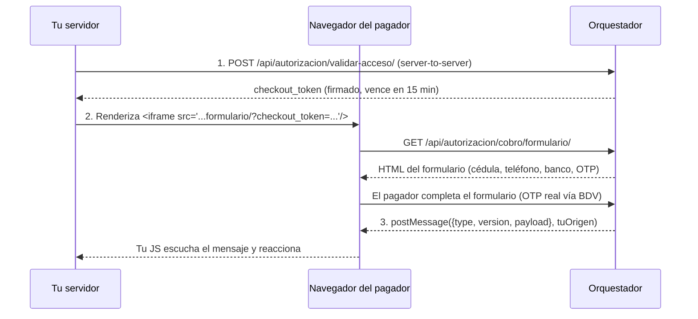

# Guía de integración — Formulario de cobro embebido (iframe)

> Para equipos de apps consumidoras (Conatel en Línea, Homologación, futuras)
> que quieran cobrar a través de la Suite Centralizada de Pagos. Extraído del
> código real de `suit-orquestador` (Bloque #10-#12 de `PLAN-DE-MEJORAS.md`).

## Antes de empezar: tu app debe estar registrada

El Orquestador rechaza cualquier intento de checkout de una app/dominio no
registrado — es un control de seguridad bloqueante, no una formalidad.

Registrá tu aplicación desde el **Developer Portal** (`/registrar` o vía la
API admin si preferís automatizarlo) con:
- **Nombre** de tu aplicación.
- **Dominio** exacto desde el que vas a embeber el iframe (sin protocolo ni
  puerto — ej. `conatel.gob.ve`, no `https://conatel.gob.ve:443`).
- **Proveedor** de pago que vas a usar (hoy solo `BDV`).

Sin este registro, el paso 1 de abajo devuelve `403`.

## El flujo completo (3 pasos)



### Paso 1 — Iniciar el checkout (server-side, nunca desde el navegador)

```
POST /api/autorizacion/validar-acceso/
Content-Type: application/json

{
  "dominio": "tu-dominio.gob.ve",
  "proveedor": "BDV",
  "monto": "1000.60",
  "moneda": "VES",
  "concepto": "Descripción legible para el pagador"
}
```

**Por qué esto va en tu servidor, no en el navegador:** `monto`/`moneda`/
`concepto` quedan atados criptográficamente dentro del `checkout_token` en
este paso — es la garantía de que nadie puede alterar el monto a cobrar
editando el HTML o la URL del iframe más adelante. Tu backend es quien sabe
cuánto factura, así que es quien debe iniciar el checkout.

**Respuesta 200:**
```json
{"autorizado": true, "aplicacion": "Tu App", "checkout_token": "<opaco, firmado>"}
```

**Respuesta 403** (dominio/app/proveedor no autorizado):
```json
{"autorizado": false, "motivo": "dominio_no_registrado"}
```
Motivos posibles: `dominio_no_registrado`, `dominio_inactivo`,
`aplicacion_inactiva`, `proveedor_no_encontrado`, `proveedor_no_autorizado`.

`checkout_token` **vence a los 15 minutos** — generalo justo antes de mostrar
la página con el iframe, no lo cachees ni lo reutilices entre sesiones.

### Paso 2 — Embeber el iframe (client-side)

```html
<iframe
  src="https://<host-del-orquestador>/api/autorizacion/cobro/formulario/?checkout_token=<el_token_del_paso_1>"
  width="420" height="480">
</iframe>
```

**Requisito de seguridad, no opcional:** tu página debe servirse exactamente
desde el dominio que registraste en el paso "Antes de empezar" — el
Orquestador arma un `Content-Security-Policy: frame-ancestors` dinámico que
solo permite ese dominio exacto. Si tu página corre en `file://`, en un
dominio distinto, o en `localhost` sin haber registrado `localhost`, el
navegador bloquea el iframe (ícono de imagen rota), no es un bug del servicio.

El formulario le pide al pagador: banco afiliado a Pago Móvil (selector,
poblado del catálogo real de bancos soportados), cédula, teléfono, y luego el
OTP. Vos no controlás ni ves esos datos — viajan directo entre el navegador
del pagador y el Orquestador.

### Paso 3 — Escuchar el resultado (`postMessage`)

```javascript
window.addEventListener('message', function (evento) {
  // Validá SIEMPRE el origen — nunca proceses un mensaje sin esto.
  if (evento.origin !== 'https://<host-del-orquestador>') return;

  var mensaje = evento.data; // { type, version, payload }

  if (mensaje.type === 'pago.completado') {
    // mensaje.payload = { pago_id, estado, referencia_corta }
    // El cobro se ejecutó. estado === "capturado" es éxito.
  }

  if (mensaje.type === 'pago.error') {
    // mensaje.payload = { status, detalle }
    // El cobro falló o fue rechazado por el proveedor.
  }
});
```

El Orquestador solo manda el `postMessage` a tu origen exacto, **nunca** con
`targetOrigin: '*'` — si por alguna razón no pudo determinar tu origen (Origin
y Referer ausentes en la petición del iframe), simplemente no manda nada; en
ese caso tu app debería tener un mecanismo alternativo de confirmación (ej.
consultar el estado del `pago_id` por tu cuenta, o un webhook — no existe
todavía, evaluar si hace falta según el volumen real de este caso).

## Errores y códigos de respuesta del proveedor

`pago.error` puede traer, dentro de `detalle`, un `codigo_proveedor` con el
código real de BDV (ver tabla completa en el PDF de proveedor). Los más
comunes en integración:
- `1013` — Monto inválido.
- `1026` / `1094` — Referencia/operación duplicada (tratalo como posible
  duplicado de tu lado, no como error de negocio a mostrar tal cual).
- `1061` — Monto supera el límite diario del pagador.
- `1080` — Documento de identidad inválido.

## Ambiente de prueba (QA/dummy)

Mientras el proveedor esté en modo QA (no producción), **solo funcionan
valores exactos documentados**, no cualquier dato de prueba:
- Cédula: `V12345678`
- Teléfono: `04125692243`
- Banco: `0102` (BDV, único disponible hoy)
- OTP: `5551111`

Podés probar el flujo completo embebido de verdad desde el Developer Portal:
`/probar-iframe` — genera un `checkout_token` real y muestra estos mismos
datos de prueba al lado del formulario.

**Quirk conocido del ambiente QA (no es un bug de este servicio):** el dummy
de BDV solo reconoce el monto de ejemplo del PDF (`1000.6`, un decimal) de
forma literal — un monto real con 2 decimales (`1000.60`, el formato correcto
de producción) puede devolver el código `1001` no documentado por ese
ambiente. En producción real esto no debería reproducirse.

## Referencia rápida de endpoints

| Endpoint | Quién lo llama | Desde dónde |
|---|---|---|
| `POST /api/autorizacion/validar-acceso/` | Tu servidor | Server-to-server |
| `GET /api/autorizacion/cobro/formulario/` | El navegador del pagador | `src` del iframe |
| `POST /api/autorizacion/cobro/otp/` y `/cobro/` | El propio formulario | Internos, no los llamás vos directo |

No necesitás llamar `/cobro/otp/` ni `/cobro/` directamente — esos los maneja
el JavaScript del formulario que vos embebés. Tu única integración real es el
paso 1 (servidor) y el paso 3 (escuchar el resultado).
